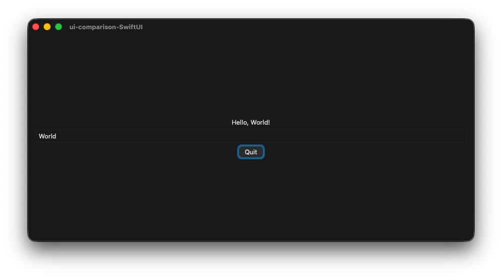

# macOS

## Accessibility

Keyboard navigation: Works
Unicode support: Works
Screen reader support: Works (Tested with VoiceOver)
Touch compatibility: Untested
Gamepad compatibility: None

Has an API specifically for accessibility: https://developer.apple.com/documentation/swiftui/accessibility-fundamentals

## Resource Usage / Start-up Time

Measured on a base model M4 Mac mini with macOS 26.2

Size of executable: 100,8KiB
Ram Usage: 25,6MiB
Start-up time: ~0.55s with profiling instrumentation
